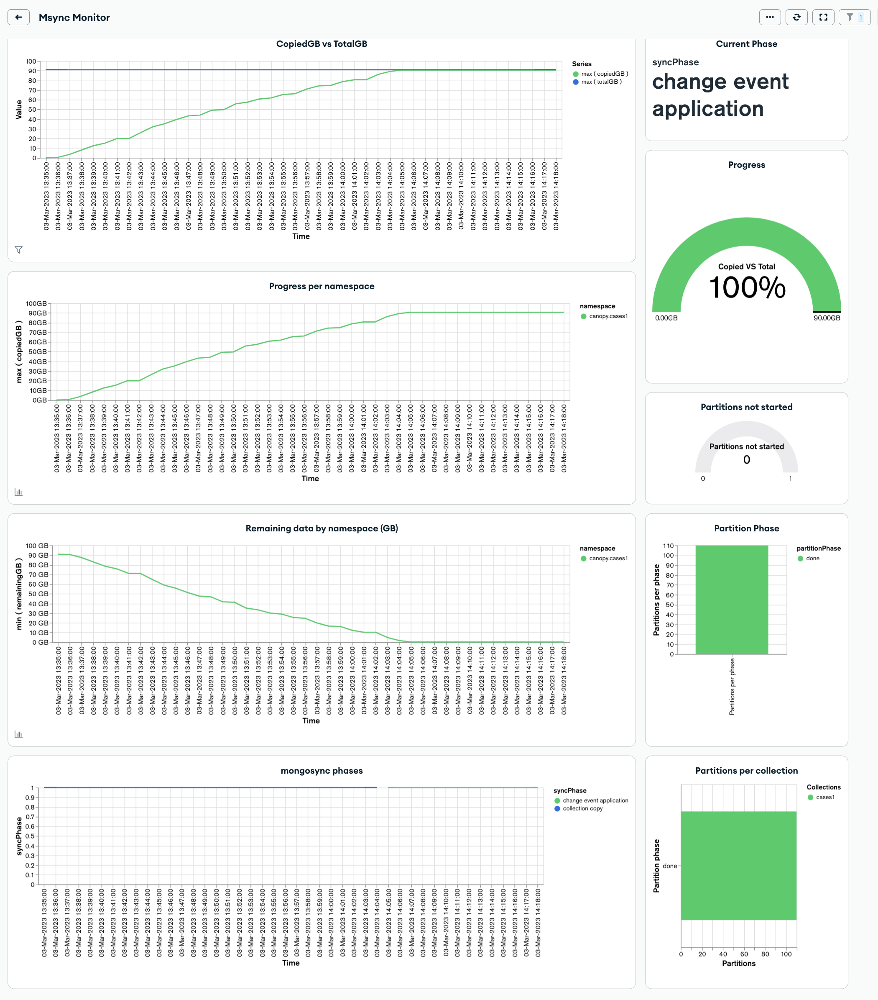

# Mongosync monitor using Charts

This repository includes a MongoDB App Service application monitors the progress of mongosync on the destination cluster and creates a timeline of its progress which is displayed in a Charts dashboard



NOTE: This is currently work in progress - if you encounter any issue, ping me (Marco Bonezzi) on slack so I can try to help. 

# Setup

Setting up this solution involves a number of steps in the Atlas web portal,
followed by some command line scripts to be run locally. Finally you will
open MongoDB Charts to import the dashboard.

## Atlas

1. Sign into [MongoDB Atlas](https://cloud.mongodb.com)
2. Create a new Project within the Atlas Organization which you wish to create the overview dashboard for. Give the project a descriptive name such as `Org Overview`.
3. Deploy a new cluster in this project to store your report data.
   Give your cluster a descriptive name such as `ReportingData`.
4. Create an API Key for the project. This will be used to programmatically
   deploy the App Services app:
   _ Ensure that `Org Overview` is your active project
   _ Click **Access Manager** on the top bar, and then **Project Access**
   _ Click **Create API Key**
   _ Enter an appropriate name for the key, e.g. `Report App Deployment`
   _ Select the `Project Owner` role.
   _ Click **Next**
   _ Record the Public and Private Key details and store them securely.
   _ Add your IP address to the API Access List. \* Click **Done** when you're ready to save the new key to your Project


## Command Line 

1. Install the following prerequisites on your computer if they aren't already
   present:
   * [Git](https://git-scm.com/downloads)
   * [Node.js](https://nodejs.org/en/download/) 
   * [MongoDB Realm CLI](https://www.mongodb.com/docs/atlas/app-services/cli/)
2. Clone this repo to an appropriate directory on your computer:
   ```
   git clone https://github.com/sisteming/mongosync_monitor
   ```
3. Change directory to the cloned project:
   ```
   cd mongosync_monitor
   ```
4. Run the setup script
   ```
   ./setupMongosyncMonitor.sh
   ```
5. When prompted, enter the public and private API keys for your Project
   as well as the name of your cluster.
6. Wait for the script to complete, and then verify that the App Services app is present
   Note that the app contains 2 triggers enabled by default which will trigger every minute. The associated functions will only run and do stuff when the internal mongosync database is present and has data on it.
7. Once this is done, you might need to configure your Atlas cluster as the data source for the App Services app (selecting the cluster from the dropdown, but keeping the service name to mongodb-atlas).

## Charts

1. Sign into [MongoDB Atlas](https://cloud.mongodb.com) and select your desired project
2. Click the **Charts** tab on the top nav, and activate Charts if you haven't done so already
3. Find the **Add Dashboard** button and click the down arrow, and then select
   **Import Dashboard**
4. Choose the `mongosync_monitor.charts` file from this repo, click **Next**.
5. If the **"Data source at destination"** says **"Connect later"**, click on the edit button next to your data source.
   1. Select **Connect now**
   2. Choose the deployment, collection and database that you created in the previous steps
   3. Click **Save** underneath the dropdown
6. Click the green **Save** button
7. Open the imported dashboard and get ready to see how mongosync migrates data to your destination cluster.

# Details

The App Services app in this repo contains three functions and two trigger. You
can view and update the deployed app by clicking the **App Services** tab on the top Atlas nav.

### Functions

`mongosyncMonitor`: Inspects the _mongosync_reserved_for_internal_use_ database, in particular the statistics and resumeData collections to gather current state, syncPhase, estimatedCopiedBytes and estimatedTotalBytes. A new document is added into the msync_monitor.monitoring collection with these metrics plus calculated values based on copied and total bytes.

`partitions`: Inspects the partitions collection (from the _mongosync_reserved_for_internal_use_ database) and go through all partitions, calling the reviewPartition function for each of them.

`reviewPartition`: For the partition received as an argument, it will collect the namespace details (db and collection), the current partitionPhase (done or not started) and will write into the partitions collection (on the msync_monitor database) with the current timestamp (every minute as called by the trigger

### Triggers

`mongosyncMonitorTrigger`: Runs every minute and triggers the _mongosyncMonitor_ function

`PartitionInfo`: Runs every minute and triggers the _partitions_ function (which calls _reviewPartition_)

# Enhancements

- TBD

# Documentation Links

- [Realm CLI](https://docs.mongodb.com/realm/deploy/realm-cli-reference/)
- [MongoDB Atlas](https://www.mongodb.com/cloud/atlas)
- [MongoDB Charts](https://docs.mongodb.com/charts/master/)
